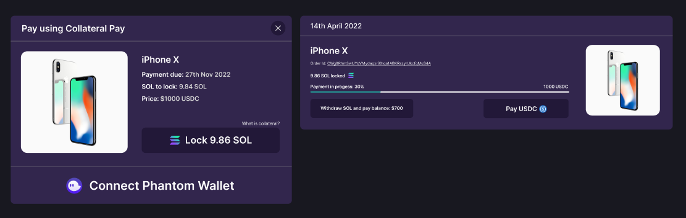

# Solana Payments Adapter

A suit of Solana payment methods.


## Usage
### Install using yarn
```shell
$ yarn add solana-payment-adapter
```
```ts
import { CollateralPayButton } from "solana-payment-adapter";

const Demo = () => {
  return (
    <CollateralPayButton />
  )
}
```
Note: yarn Package is not yet published, since it's under development!

## Video Demo
Video Link: https://www.youtube.com/watch?v=pzEvP102NbY 
